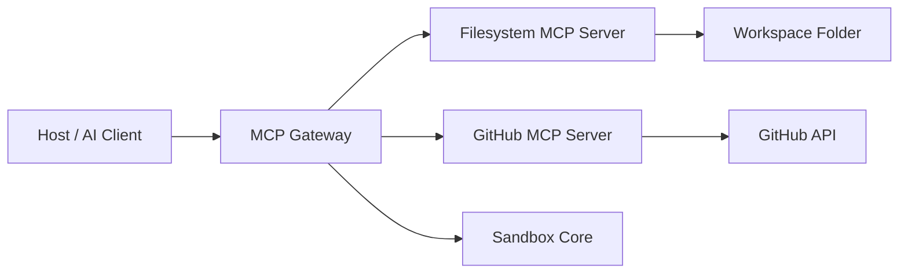
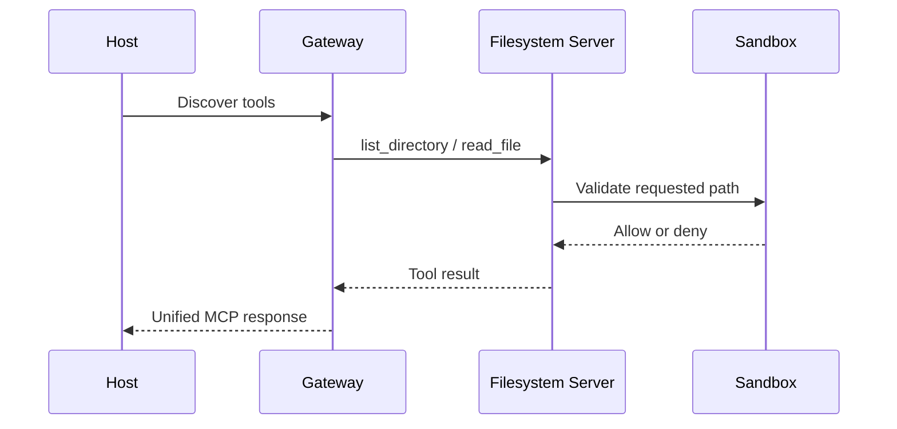

# mini-mcp

## What is MCP?

**MCP** stands for **Model Context Protocol**. It is an open protocol that provides a standard way for AI applications to connect to external tools and data sources. A host application can connect to an MCP server, discover the tools it exposes, and issue tool calls in a consistent format instead of building custom integrations for each service.

In this project, MCP servers provide tools, and the **Gateway** connects to them and exposes a combined tool set to the host. Local inter-process communication uses **stdio**.

## About the project

`mini-mcp` is a small Python prototype that includes:

- **Filesystem MCP Server**: tools for listing, reading, and modifying files within a configured workspace, with path isolation and protection against sensitive files.
- **GitHub MCP Server**: tools for searching repositories, reading repository and issue details, creating issues, and adding comments.
- **MCP Gateway**: connects to the configured servers from a YAML file and exposes their tools through a single MCP endpoint. It prefixes each tool name as `server__tool_name` and prompts interactively before executing destructive operations.
- **Sandbox Core**: shared logic for validating that file paths remain inside the workspace and preventing reads or writes to sensitive file patterns.

## Requirements

- Python 3.11 or newer
- [uv](https://docs.astral.sh/uv/) for environment management and project command execution
- Internet access for GitHub-related tools

## Installation

From the project folder:

```powershell
uv sync
```

## Configuration

### Filesystem workspace

You must define the workspace folder that the filesystem server is allowed to access. In PowerShell, set the environment variable before starting the server or the gateway:

```powershell
$env:FS_SERVER_WORKSPACE = 'C:\path\to\workspace'
```

You can also pass the path directly when launching the filesystem server using `--workspace` or `-w`. All file paths accepted by the tools are resolved relative to the workspace root, and absolute paths or attempts to move outside the workspace are blocked.

### GitHub

The GitHub server requires the `GITHUB_TOKEN` environment variable to be set before startup:

```powershell
$env:GITHUB_TOKEN = 'your-github-token'
```

Do not store real access tokens in project files or in the repository. **Warning:** the client implementation in `mcp_github_server/tools.py` currently uses a hardcoded placeholder value in the `Authorization` header instead of passing the loaded token, so this wiring must be fixed before relying on authenticated GitHub requests.

## VS Code MCP configuration

To register this project in VS Code as an MCP server, add a configuration like the following to your VS Code MCP config file:

```json
{
  "servers": {
    "Mini_mcp": {
      "type": "stdio",
      "command": "uv",
      "args": [
        "run",
        "python",
        "-m",
        "mcp_gateway.server"
      ],
      "cwd": "G:/__TESSERACT_AI/mini mcp servers/mini-mcp-servers",
      "env": {
        "FS_SERVER_WORKSPACE": "G:/__TESSERACT_AI/mini mcp servers/mini-mcp-servers",
        "GITHUB_TOKEN": "your_github_token_here"
      }
    }
  }
}
```

### How to use it in VS Code

1. Open the MCP settings or your JSON config file in VS Code.
2. Add a new server entry using the block above.
3. Make sure `cwd` points to the project folder.
4. Set `FS_SERVER_WORKSPACE` to the local folder you want the filesystem tools to access.
5. Set `GITHUB_TOKEN` to your GitHub token, or keep it in your shell environment instead of storing it in source control.
6. Reload the MCP session or restart VS Code if needed.

### Testing with Inspector

You can also test the server manually with MCP Inspector or a similar tool:

```powershell
uv run python -m mcp_gateway.server
```

Or with a command-based MCP inspector setup:

```powershell
npx @modelcontextprotocol/inspector
```

Then point the inspector to the same command and environment values shown above.

## Running the project

### Start the Gateway

From the project root, after configuring the required environment variables:

```powershell
uv run python -m mcp_gateway.server
```

The gateway reads its configuration by default from [`mcp_gateway/gateway_config.yaml`](mcp_gateway/gateway_config.yaml) and launches the configured servers as child processes. You can specify a different config file with `GATEWAY_CONFIG_PATH`.

The combined tools appear with names such as:

- `fs__list_directory`
- `fs__read_file`
- `github__search_repos`

Tools marked with `destructiveHint` require user confirmation in the terminal before the call is forwarded to the original server.

### Start an individual server

To run the filesystem server directly:

```powershell
uv run python -m mcp_fs_server.server
```

Or to run it in development mode with MCP Inspector:

```powershell
uv run mcp dev mcp_fs_server/server.py -- --workspace 'C:\path\to\workspace'
```

To run the GitHub server directly, after setting `GITHUB_TOKEN`:

```powershell
uv run python -m mcp_github_server.server
```

## Available tools

### Filesystem tools (`fs`)

| Tool | Description |
|---|---|
| `list_directory` | Lists files and folders within the workspace. Hidden files are excluded by default. |
| `read_file` | Reads a text file; the maximum read size is 200,000 characters. |
| `write_file` | Creates a file or replaces its full content. |
| `edit_file` | Replaces one exact match inside a file; the old text must be found exactly once. |

The sandbox protects against escaping the workspace root and blocks reads or writes to sensitive patterns such as `.env` and private key files. Template files like `.env.example`, `.env.sample`, and `.env.template` are exempt from this block. Showing a filename in a directory listing does not necessarily imply that the file content is allowed to be read.

### GitHub tools (`github`)

| Tool | Description |
|---|---|
| `search_repos` | Searches public repositories. |
| `get_repo_info` | Reads repository details. |
| `list_issues` | Lists open, closed, or all issues while excluding pull requests from the results. |
| `create_issue` | Creates a new issue. |
| `add_comment` | Adds a comment to an issue or pull request. |

## Testing

```powershell
uv run pytest
```

## Project structure

```text
mcp_fs_server/       Filesystem server and tools
mcp_github_server/   GitHub server and tools
mcp_gateway/         Connects to servers and exposes combined tools
mcp_sandbox_core/    Path validation and file protection logic
```

## Architecture overview



## Request flow



## Summary

This project demonstrates a lightweight MCP architecture in which individual servers expose focused capabilities, while a central gateway unifies them into a single tool interface. The filesystem sandbox adds a safety layer that helps ensure tools remain within a controlled workspace and do not access sensitive files.

## Credits

This README and the MCP configuration guidance were prepared using the `mini-mcp` gateway connected through the MCP server configuration available in VS Code. The project context and file editing workflow were supported by the local MCP toolchain integrated into the editor.
